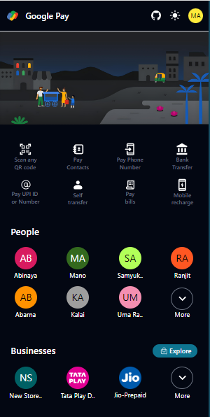
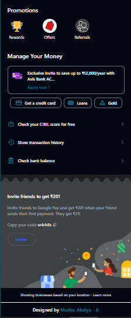
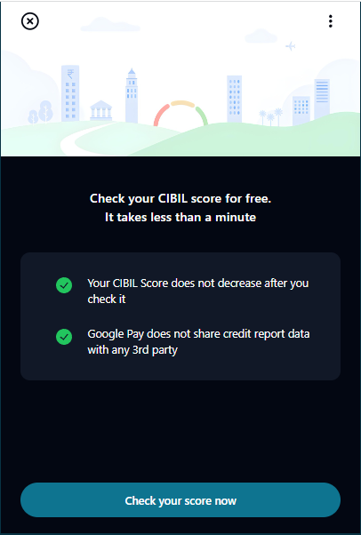
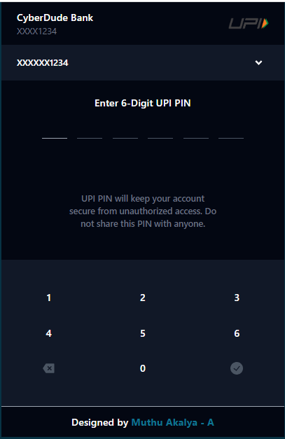

# Google Pay UI Challenge By Muthu Akalya 

Cyberdude Networks Pvt. Ltd Internship Project # 4 - **Google Pay UI Challenge**.

## Table of Contents
- [Google Pay UI Challenge By Muthu Akalya ](#google-pay-ui-challenge-by-Muthu-Akalya)
  - [Table of Contents](#table-of-contents)
  - [Description](#description)
  - [Demo](#demo)
  - [Internship](#internship)
  - [Technologies Used](#technologies-used)
  - [Features](#features)
  - [Contributing](#contributing)
  - [License](#license)
  - [Acknowledgments](#acknowledgments)

## Description

This UI challenge gave me a confident on using Vite and Tailwind CSS also including building and deployment made easy for me without any errors at first. 

 

## Demo

✨**Live Link is Here**: https://muthuakalya.github.io/Google-Pay-UI/
 
 

 

 

 

## Internship

This internship is provided by [CyberDude Networks Pvt. Ltd.](https://youtube.com/cyberdudenetworks) as part of the 6-Month Free Internship program, a skill development initiative organized to enhance participants' skills. Mentoring was provided by [Mr. Anbuselvan Rocky](https://instagram.com/anbuselvanrocky). For more information, [you can contact CyberDude Networks here](https://cyberdudenetworks.com).

## Technologies Used

HTML 5 | Tailwind CSS | Vite

## Features

- Dark mode & light mode enabled (manually without tailwind)
- Check Bank balance page 
- Check Your CIBIL score for free page

## Contributing

Feel free to contribute to this project by "Forking" this repo, and Add a PR for any additional features that can be added this UI Challenge. 

## License

MIT

## Acknowledgments
Special thanks to [Mr. Shajid Shafee (GitHub)](https://github.com/mshajid), for helping me to understand grid layout .

Special thanks to [Vasanth (Github)](https://github.com/vk2401) for relevant banners and assets.

---

  

